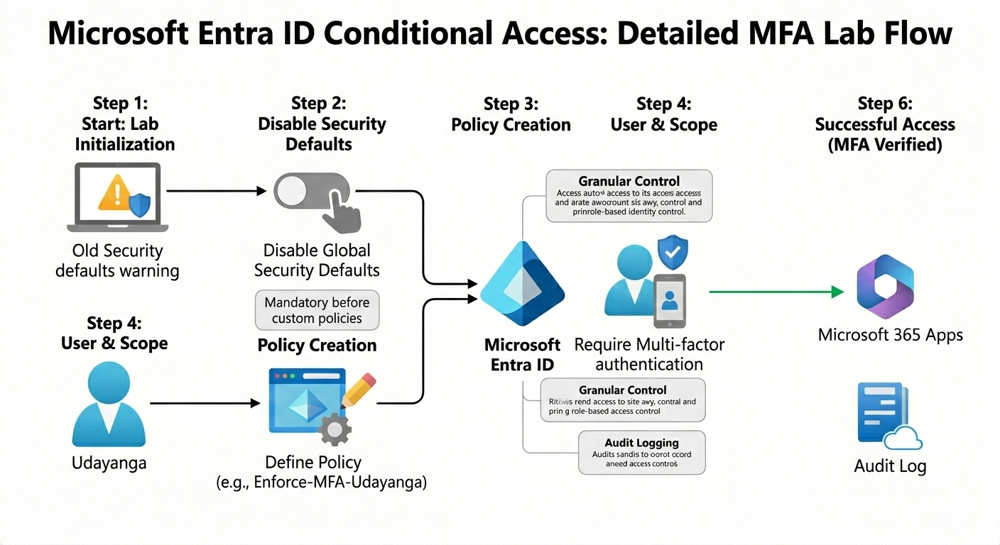
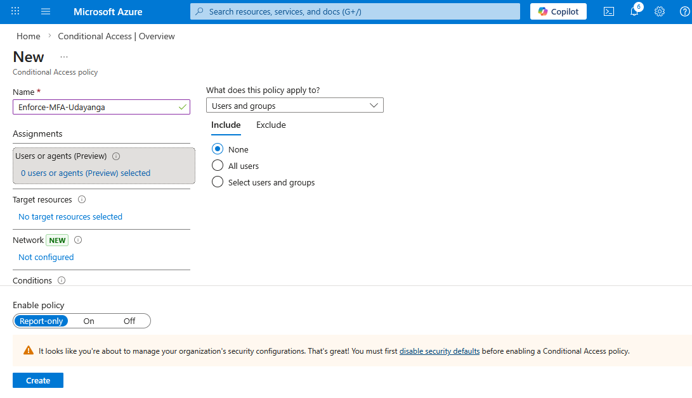
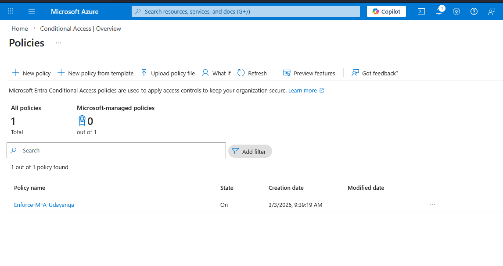
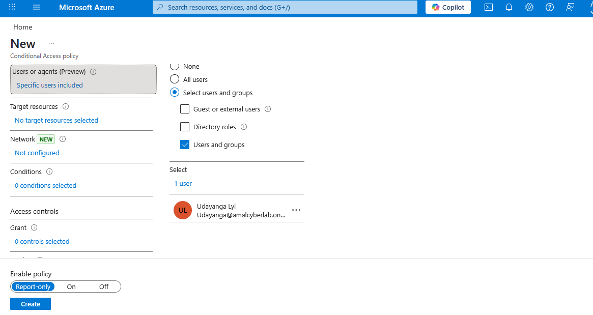

  
  
  
  
  

<h1 align="center">🛡️ Azure Conditional Access – MFA Enforcement Lab</h1>

  <strong>Zero Trust Identity Protection using Microsoft Entra ID</strong> 
  Secure, test, and validate Multi-Factor Authentication (MFA) enforcement using Conditional Access.  
  AZ-500 Aligned • Enterprise Deployment Simulation • Identity Security Focus

---

## 📌 Executive Overview

This lab demonstrates the design and validation of a **Microsoft Entra ID Conditional Access policy** to enforce **Multi-Factor Authentication (MFA)** for a targeted user.

The implementation follows enterprise best practices by:

- Enforcing least privilege identity controls  
- Deploying policy in **Report-only mode** for safe testing  
- Validating impact before production rollout  
- Aligning with **Zero Trust architecture principles**

---

# 🏗️ Architecture Overview

  

  <em>Figure 1 — Conditional Access acting as a Zero Trust enforcement layer between user identity and cloud resources.</em>

### 🔎 Architecture Flow

1. User initiates sign-in request  
2. Conditional Access policy evaluates conditions  
3. Grant Control triggers **Require MFA**  
4. MFA challenge is presented  
5. Access granted only after successful verification  
6. Sign-in event recorded in Entra ID logs  

Conditional Access functions as a **policy decision engine** protecting cloud identities from unauthorized access.

---

# 🎯 Lab Objectives

- Target a specific internal user  
- Enforce **Require Multi-Factor Authentication**  
- Deploy policy using **Report-only mode**  
- Validate configuration and status  
- Simulate enterprise-safe rollout strategy  

---

# 🛡️ Core Identity Security Concepts

- User-based targeting  
- Grant Controls (Require MFA)  
- Report-only safe deployment  
- Policy state management  
- Zero Trust identity enforcement  

---

# 📸 Implementation Evidence

---

## 1️⃣ Policy Creation – Specific User Targeting

  

  <em>Figure 2 — Creating Conditional Access policy targeting a specific internal user.</em>

---

## 2️⃣ Policy Configuration – Require MFA

  

  <em>Figure 3 — Configuring Grant Control to require Multi-Factor Authentication.</em>

---

## 3️⃣ Policy Status Verification

  

  <em>Figure 4 — Policy enabled and visible in Conditional Access overview.</em>

---

## 4️⃣ Report-Only Mode Deployment

  

  <em>Figure 5 — Report-only mode enabled for safe evaluation before enforcement.</em>

---

# 🚀 Implementation Steps Summary

1. Created Conditional Access policy: **Enforce-MFA-Udayanga**  
2. Selected specific user under Assignments  
3. Configured Grant Control → Require MFA  
4. Set policy state to **Report-only**  
5. Enabled policy  
6. Verified status in dashboard  

---

# 🔐 Security Impact Analysis

### Without Conditional Access + MFA

- High credential compromise risk  
- Single-factor authentication weakness  
- Increased likelihood of account takeover  

### With Conditional Access + MFA

- Strong identity verification  
- Reduced attack surface  
- Zero Trust enforcement  
- Improved compliance posture  

MFA remains one of the most effective controls against identity-based attacks.

---

# 🎓 AZ-500 Certification Alignment

Supports:

- Secure identity & access  
- Configure Conditional Access  
- Implement MFA controls  
- Monitor identity security posture  

---

# 🧠 Key Takeaways

- Conditional Access is a policy-driven enforcement engine  
- Report-only mode enables safe enterprise deployment  
- Targeted rollout minimizes operational risk  
- Identity is the modern security perimeter  

---

# 👨‍💻 Author

**Amal Basnayake**  
Cloud Security • Identity Governance • Zero Trust Architecture  

🔗 LinkedIn: https://www.linkedin.com/in/amal-udayanga-basnayake  
🔗 GitHub: https://github.com/AmalUBasnayake  

---

⭐ If this lab supported your Azure Security journey, consider starring the repository.

