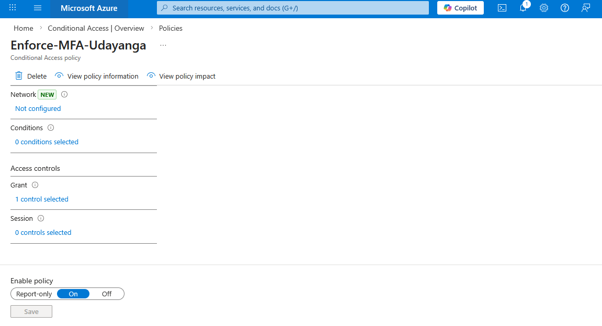

  
  
  
  
  

<h1 align="center">🛡️ Azure Conditional Access – MFA Enforcement Lab</h1>

  <strong>Zero Trust Identity Protection using Microsoft Entra ID</strong> 
  Secure, test, and validate Multi-Factor Authentication (MFA) enforcement using Conditional Access policies.  
  <b>AZ-500 Aligned • Enterprise Deployment Simulation • Identity Security Focus</b>

---

## 📌 Executive Overview

In modern cloud security, **Identity is the new perimeter.** This lab demonstrates the end-to-end configuration and validation of a **Microsoft Entra ID Conditional Access (CA) policy**. The primary goal was to enforce **Multi-Factor Authentication (MFA)** for specific high-risk users without disrupting the entire organizational workflow.

This implementation follows the **Zero Trust principle: "Verify Explicitly"** by:
- Targeting specific users to minimize the "blast radius" of policy changes.
- Utilizing **Report-only mode** to evaluate impact before full enforcement.
- Aligning with compliance standards (NIST/ISO) by requiring secondary verification.

---

# 🏗️ Architecture Overview

Conditional Access is the "Policy Engine" that sits between a connection request and the resource.

  

### 🔎 The Policy Decision Engine
1. **Signals:** User identity, IP location, device state, and application requested.
2. **Decisions:** Evaluation of the signals against the CA policy.
3. **Enforcement:** Grant Access, **Require MFA**, or Block Access.

---

# 🎯 Lab Objectives

- **Targeted Deployment:** Isolate specific internal users for policy application.
- **Grant Control Implementation:** Configure the policy to trigger an MFA challenge.
- **Safe Rollout Strategy:** Utilize **Report-only mode** to analyze logs before a "hard" switch.
- **Identity Governance:** Validate the policy state within the Entra ID dashboard.

---

# 📸 Implementation Evidence (Step-by-Step)

### 1️⃣ Identity Targeting & Assignments
Precise targeting is key to preventing accidental lockouts of administrative accounts.

  

*Figure 2 — Defining the "Who": Targeting specific test users for the MFA pilot.*

---

### 2️⃣ Access Control Logic (Grant Phase)
This is where the security requirement is enforced.

  

*Figure 3 — Setting the Condition: "Require Multi-Factor Authentication" must be satisfied for successful login.*

---

### 3️⃣ Strategic Deployment (Report-Only Mode)
A critical enterprise step. This allows admins to see if the policy would have blocked/challenged a user without actually affecting them.

  

*Figure 4 — Deployment Strategy: Using Report-Only mode to validate policy logic against real-time sign-in logs.*

---

### 4️⃣ Final Policy Status

  

*Figure 5 — Dashboard view showing the active policy state in the Entra ID tenant.*

---

# 🔐 Security Impact Analysis

| Risk Factor | Before Implementation | After Implementation |
| :--- | :--- | :--- |
| **Credential Theft** | High (Single point of failure) | **Mitigated (MFA required)** |
| **Account Takeover** | Easy via Phishing/Brute Force | **Hardened (Secondary verification)** |
| **Compliance** | Non-compliant (Identity risk) | **Compliant (Zero Trust Aligned)** |

---

# 🧠 Key Takeaways
- **Zero Trust:** Never trust, always verify. MFA is a non-negotiable layer in Zero Trust.
- **Operational Safety:** Always use **Report-only** mode in production environments to prevent "Helpdesk Storms."
- **Policy Granularity:** Conditional Access allows for surgical precision in who, when, and where security is enforced.

---

# 👨‍💻 Author
**Amal Basnayake** *Cloud Security Enthusiast | Identity & Access Management | AZ-500 Candidate*

🔗 **LinkedIn:** [Amal Udayanga Basnayake](https://www.linkedin.com/in/amal-udayanga-basnayake)  
🔗 **GitHub:** [AmalUBasnayake](https://github.com/AmalUBasnayake)

---

⭐ Found this lab useful? Feel free to star the repo and follow my Azure Security journey!

